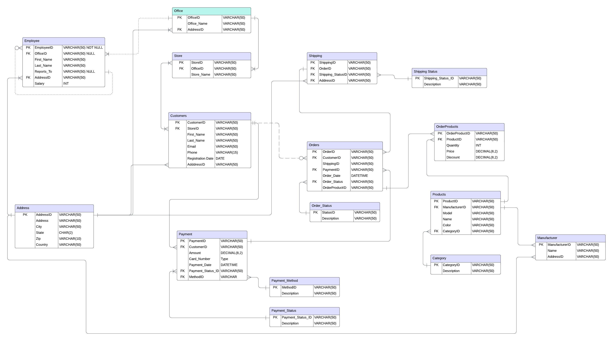

# Introduction:
The goal of this project is to showcase our learning journey in database management, SQL, data analysis, and dashboard building while delivering a tailored solution for a new clothing brand redefining 90s aesthetics, called *Heirloom*. The company, founded in 2024, needs a database to manage customer orders, manufacturing details, shipping statuses, and more, while gaining actionable insights to elevate customer satisfaction through personalization. We've collaborated with their CEO and decision-makers to identify key entities—customers, products, orders, payments, shipping, manufacturers, employees, and offices—that will shape the foundation of a robust relational database. 

**Want to fast-forward to the results page?** I don't blame you, this is a lot. [Click for Results](/Analysis/)

### Background:
As we dive further into a digital age that intertwines itself with out logistical norms, the e-commerce landscape has never been as competitive as before. Data has become the vital resource. 

This project stems from a real-world *mock* scenario where a newly launched clothing company seeks to differentiate itself by reviving 90s aesthetics while meeting modern consumer demands. Leadership recognized that an efficient operations, thriving company culture, and personalized customer experiences require, a much needed, effective database system that would allow them to update, maintain, and extrapolate critical insightful data that would lead them to make better business decisions.

With no existing infrastructure, my goal was to design a solution from scratch that addressed their needs, including order tracking, inventory management, and customer insights. This project has not only provided hands-on experience but also challenged me to think critically about how data structures impact business outcomes.

## Tools I Use:
- **MySQL**: For database creation, management, and query processing.
- **Visual Studio Code (VS Code)**: As an IDE to write and manage SQL scripts.
- **LucidChart**: To design the Entity Relationship (ER) Diagram and map database relationships.
- **Python**: For data visualization.
- **Notion**: For project management, task tracking, and timekeeping.
- **Excel**: Data cleaning and preparation.
- **Mockaroo**: Generating sample data.

## The Analysis:
This project follows both the **Data Engineering** Lifecycle and the **Data Analyst** Lifecycle, ensuring a systematic approach from start to finish. Every step is designed to address the brand’s challenges and opportunities effectively. Here’s a detailed breakdown of the process:

1. **Problem Identification**: Understand pain points and identify opportunities for operational improvement and customer satisfaction.

2. **Data Collection**: Generated sample data using Mockaroo and refined it using Excel for data cleaning to ensure accuracy and relevance.

3. **Data Understanding and Exploration**: Conducted exploratory data analysis to identify patterns, trends, and anomalies in the data.

4. **Entity Identification and ER Diagram Development**: Defined key components of the database and mapped their relationships using Lucidchart to create a normalized relational database structure.

5. **Schema Design**: Designed tables and attributes to support the brand’s operational and analytical needs, focusing on scalability and flexibility.

17. **Normalization**:
    - The introduction of the `Address` table resolves redundancy and ensures normalization. This is a significant improvement in terms of database efficiency and maintainability.
18. **Scalability**:
    - The design is now more scalable. The `Address` table can easily accommodate new types of entities requiring addresses (e.g., warehouses or suppliers).
    - **Scalability**: Adding `OrderProducts` significantly improves flexibility for handling orders with multiple products. It also supports complex scenarios like bulk discounts or item-specific pricing.

6. **Descriptive Analysis**: Developed SQL queries to summarize historical data, such as total sales, most popular products, and shipping performance.

7. **Predictive Analysis**: Laid the groundwork for future predictive models, such as forecasting demand and identifying potential bottlenecks in the supply chain.

8. **Data Visualization**: Utilized Python to create and draw graphical data represented in the queries ran.

## What I Learned:
It's hard to pinpoint where to begin. On a personal level, this experience reinforced the importance of clear communication and adaptability. Over each step of the way along the project, I encountered numerous amounts of errors and issues that needed to be resolved for this project to come to fruition. Learning how to bridge the gap between technical skills and business goals.
- Designing normalized relational databases.
- Writing efficient SQL queries for data manipulation and reporting.
- Using visualization tools to communicate insights effectively.
- Managing a project from ideation to execution.

## Conclusions:
This project has been a rewarding opportunity to apply database and data analysis concepts to a real-world scenario. The result is a comprehensive system that not only meets the immediate operational needs of the clothing brand but also lays the foundation for strategic growth. By following established lifecycle, I’ve ensured that the project is both robust and adaptable. I’m excited about the potential impact this database can have on their success and look forward to applying these skills to future projects.

### Things That I Would Fix:
Because this project took a large portion of my time of studying, it didn't turn out quite perfect. And I plan on fixing the mistakes when I have some ample time. Although the ERD was drawn it was not particularly followed. Some of the data needs to be cleaned again, and another relationship needs to be created between the OrderProducts and the Products table. 